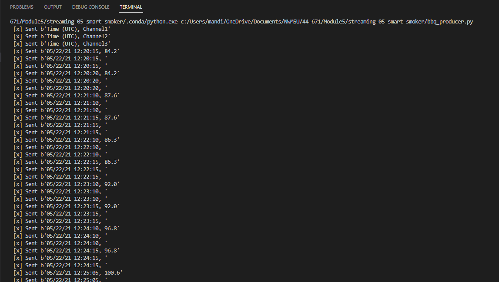
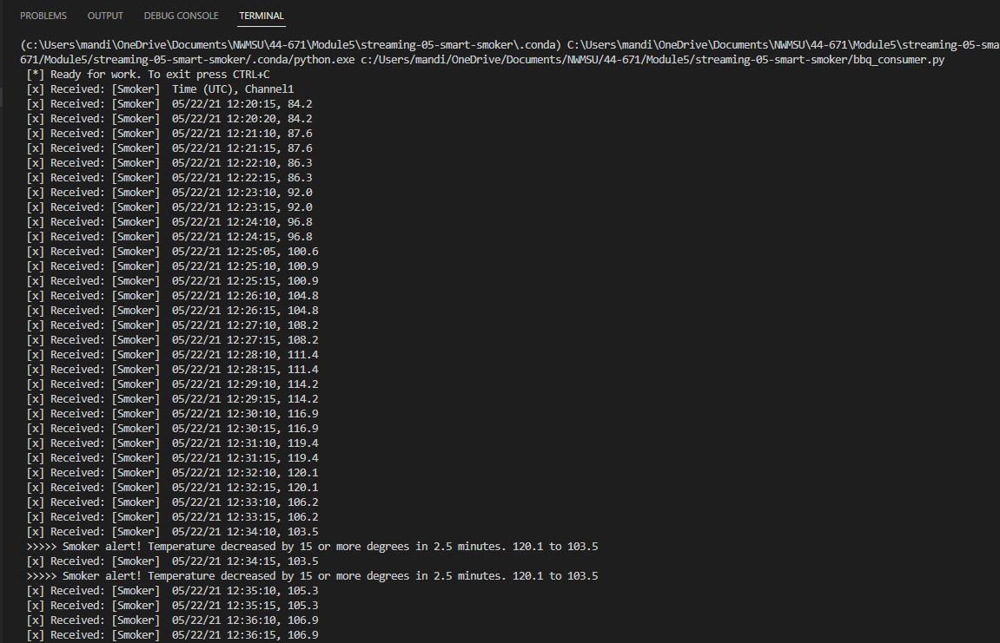
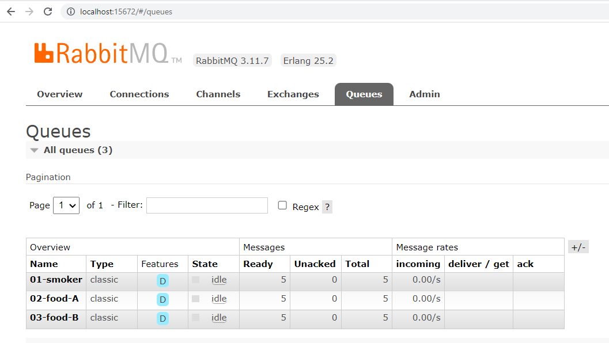

# Amanda Hanway - Streaming Data, Modules 5-6
- Date: 2/4/23

# streaming-05-smart-smoker

## Program Overview:
- Bbq_producer.py
    - This program gets data from a csv file then sends each column as a message to a different queue on the RabbitMQ server every 30 seconds.   
- Bbq_consumer.py
    - This program listens for messages from three queues on the RabbitMQ server, continuously.
    - It performs transformations on messages when received and generates an alert message when specific events occur.    
- CSV Data Source
    - The smoker-temps.csv file contains 4 columns of data from a smart bbq smoker:
        - Time = Date-time stamp for the sensor reading
        - Channel1 = Smoker Temp 
        - Channel2 = Food A Temp 
        - Channel3 = Food B Temp 

## Prerequisites:
- Requires RabbitMQ server to be running and pika to be installed in your active environment
- Installation instructions:
    - https://www.rabbitmq.com/download.html 
    - https://anaconda.org/conda-forge/pika  
```
# install rabbitmq on windows using chocolatey
choco install rabbitmq

# install pika on windows using conda-forge
conda install -c conda-forge pika
```

## Instructions:
- Bbq_producer.py
    - Set your host name if it is different from localhost
    - Turn on (show_offer=true) or turn off (show_offer=false) asking the user if they'd like to open the RabbitMQ Admin site 
    - Set the csv file name
    - Run the program in terminal 1
- Bbq_consumer.py
    - Set your host name if it is different from localhost   
    - Run the program in terminal 2
    - Open additional terminals to run the consumer as needed

## Project Requirements - Smart Smoker Description:
- Using a Barbeque Smoker
    - When running a barbeque smoker, we monitor the temperatures of the smoker and the food to ensure everything turns out tasty. Over long cooks, the following events can happen:
        - The smoker temperature can suddenly decline.
        - The food temperature doesn't change. At some point, the food will hit a temperature where moisture evaporates. It will stay close to this temperature for an extended period of time while the moisture evaporates (much like humans sweat to regulate temperature). We say the temperature has stalled.
 
- Sensors
    - We  have temperature sensors track temperatures and record them to generate a history of both (a) the smoker and (b) the food over time. These readings are an example of time-series data, and are considered streaming data or data in motion.

- Streaming Data
    - Our thermometer records three temperatures every thirty seconds (two readings every minute). The three temperatures are:
        - the temperature of the smoker itself.
        - the temperature of the first of two foods, Food A.
        - the temperature for the second of two foods, Food B.

- Significant Events
    - We want know if:
        - The smoker temperature decreases by more than 15 degrees F in 2.5 minutes (smoker alert!)
        - Any food temperature changes less than 1 degree F in 10 minutes (food stall!)

- Smart System
    - We will use Python to:
        - Simulate a streaming series of temperature readings from our smart smoker and two foods.
        - Create a producer to send these temperature readings to RabbitMQ.
        - Create three consumer processes, each one monitoring one of the temperature streams. 
        - Perform calculations to determine if a significant event has occurred.

- Optional: Alert Notifications
    - Optionally, we can have our consumers send us an email or a text when a significant event occurs. 
    - You'll need some way to send outgoing emails. 

## Screenshot - Producer Program Running in Terminal:


## Screenshot - Consumer Program Running in Terminal:


## Screenshot - Producer & Consumer Programs Running Concurrently:


## Screenshot - RabbitMQ Management Console:



